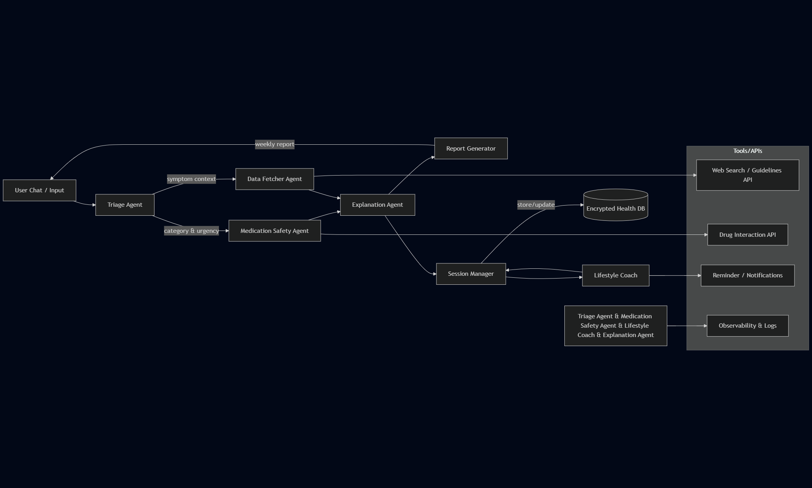

# MedAssist - Multi-Agent Healthcare Assistant

A comprehensive healthcare AI system that provides intelligent symptom triage, medication safety checking, and health monitoring through a multi-agent architecture.

## Overview

MedAssist is designed to bridge the gap between patients and healthcare providers by offering:

- **Intelligent Symptom Triage**: AI-powered analysis with safety-first approach
- **Medication Safety**: Real-time drug interaction checking
- **Health Monitoring**: Continuous background health tracking
- **Multi-Agent Coordination**: Parallel processing for comprehensive assessments
- **Memory & Context**: Long-term health history management

## Core Components

- **Triage Agent**: LLM-powered symptom analysis with rule-based safety overrides
- **Medication Agent**: Drug interaction and safety assessment
- **Reminder Agent**: Background health monitoring and alerts
- **Coordination System**: Multi-agent orchestration and communication

---

## Problem Statement

Healthcare accessibility remains a significant challenge. Patients often struggle with:
- Understanding when symptoms require immediate attention
- Managing complex medication regimens safely
- Accessing timely health guidance
- Maintaining consistent health monitoring

MedAssist addresses these challenges through an intelligent, multi-agent system that provides 24/7 health guidance while maintaining safety as the top priority.

---

## Key Features

### Intelligent Triage System
- **Smart Analysis**: Combines LLM reasoning with rule-based safety checks
- **Emergency Detection**: Automatic escalation for critical symptoms
- **Structured Output**: Consistent, actionable recommendations
- **Safety First**: Deterministic rules override AI when safety is at risk

### Medication Safety
- **Interaction Checking**: Real-time drug interaction analysis
- **Risk Assessment**: Categorized risk levels with clear guidance
- **Duplicate Detection**: Prevents accidental double-dosing

### Health Monitoring
- **Continuous Tracking**: Background monitoring of health patterns
- **Smart Reminders**: Automated alerts for medication reviews
- **Historical Analysis**: Long-term health trend identification

### Technical Architecture
- **Multi-Agent System**: Coordinated agents for comprehensive analysis
- **RESTful API**: Clean, documented endpoints
- **Scalable Database**: SQLModel with easy migration path
- **Production Ready**: Docker containerization and health checks

---

# **Architecture**



```
User
  ↓
FastAPI Backend (/triage)
  ↓
Triage Agent
  ├─ Rule-based red-flag detection
  └─ LLM-based classification & reasoning
  ↓
Decision Output (JSON)
  ↓
Database (User + SymptomEvent)
  ↓
Session Manager (future)
  ↓
Multi-agent pipeline (future)
```

---

# **Repository Structure**

```
medassist/
├─ app/
│  ├─ main.py               # FastAPI entrypoint
│  ├─ agents/
│  │  ├─ triage.py          # Triage agent logic
│  │  └─ llm_client.py      # Wrapper for LLM API
│  ├─ db/
│  │  ├─ db.py              # Init engine + sessions
│  │  └─ models.py          # SQLModel ORM models
│  ├─ prompts.py            # Prompt templates
│  ├─ schemas.py            # Request/response schemas
│  └─ utils.py              # Helpers (logging, scoring, etc.)
├─ tests/
│  ├─ test_triage.py        # Basic triage tests
├─ requirements.txt
├─ Dockerfile
├─ README.md
└─ .env
```

---

# **Installation & Setup**

### **1. Clone**

```bash
git clone https://github.com/yourusername/medassist.git
cd medassist
```

### **2. Create virtual environment**

```bash
python -m venv .venv
source .venv/bin/activate
```

### **3. Install dependencies**

```bash
pip install -r requirements.txt
```

### **4. Create `.env` file**

```
GEMINI_API_KEY=your-key
GEMINI_MODLE=your-modle
DATABASE_URL=sqlite:///./medassist.db
```

### **5. Run server**

```bash
uvicorn app.main:app --reload
```

---

# 🔌 **API Documentation**

## **POST /triage**

### Request:

```json
{
  "user_id": "user-123",
  "symptoms": "I have severe headache and blurry vision",
  "context": ""
}
```

### Response:

```json
{
  "category": "neurological",
  "urgency": "high",
  "red_flags": ["severe headache"],
  "recommended_action": "go_to_er",
  "reasoning": "Severe sudden headache + visual changes indicate possible neurological emergency."
}
```

## **POST /medications/check**

### Request:

```json
{
  "user_id": "user-123",
  "medications": ["warfarin", "aspirin"]
}
```

### Response:

```json
{
  "risk_level": "high",
  "conflicts": [
    {
      "medications": ["aspirin", "warfarin"],
      "severity": "high",
      "reason": "Both thin blood; combination raises hemorrhage risk."
    }
  ],
  "guidance": "High-risk combination detected; seek medical guidance immediately."
}
```

## **GET /users/{user_id}/reminders**

Returns generated reminder events for a user.

## **POST /reminders/pause**

Pause the long-running reminder loop.

## **POST /reminders/resume**

Resume the loop agent.

## **GET /reminders/status**

Inspect loop state (running + next run timestamp).

---

# **The Triage Agent (Detailed)**

### LLM Prompting

* JSON-only output
* Consistent categories
* Safety-first reasoning

### Rule Engine

* Scans for dangerous symptom phrases
* Overrides LLM when emergency keywords appear
* Guarantees deterministic escalation

### Final Output

* Category
* Urgency
* Red flags
* Recommended action
* Short explanation

This hybrid approach yields **safe, reliable, audit-friendly** medical triage.

---

# **Extending into Full Multi-Agent MedAssist**

You can expand from the MVP into the full system:

### ✔ Medication Safety Agent

* MVP shipped: rule-based interaction checker + duplicate-dosing guardrails
* Outputs aggregate risk level, conflict list, and clinician-ready guidance
* Future: integrate **RxNorm**, **OpenFDA**, **DrugBank**, or retrieval tools for richer data

### ✔ Explanation Agent

* Convert medical jargon → simple English
* Re-explain triage decisions
* Provide lifestyle suggestions

### ✔ Lifestyle / Habit Coach

* Tracks: sleep, food, water intake, exercise
* Generates routines & reminders
* Produces weekly PDF report

### ✔ Session Manager Agent

* Maintains long-term user health memory
* Smart context compaction
* Stores symptom timeline

### ✔ Weekly Monitoring / Loops

* APScheduler or Cloud Cron
* Auto-generate reports
* Push reminders

Each agent will be added in `/app/agents/`.

---

# **Safety & Compliance**

MedAssist is **NOT a medical device**.
It provides **informational triage assistance**, not diagnosis.

### Safety Layers Implemented:

* Deterministic red-flag engine
* LLM response parsing + fallback
* Clear disclaimers
* Immediate ER escalation for dangerous symptoms
* Logging for decision transparency
* No hallucinated drug recommendations

### Before production:

* HIPAA compliance (if in US)
* Encrypted DB (AES/GCP/CloudSQL/KMS)
* Consent screen
* Data retention policies
* Moderate outputs for safety

---

# **Evaluation Plan**

### 1. **Unit Tests**

* Rule-based red flag checks
* JSON parsing
* DB writes/reads

### 2. **Agent Reasoning Tests**

* Synthetic symptom dataset
* Compare LLM decisions with gold-standard labels

### 3. **Safety Tests**

* Force dangerous inputs
* Ensure consistent ER escalation

### 4. **Observability**

Log:

* Prompt
* Raw LLM output
* Parsed output
* Final decision
* Reason for escalation

---

# ☁️ **Deployment: Cloud Run (Recommended)**

### Build:

```bash
docker build -t gcr.io/PROJECT_ID/medassist .
```

### Push:

```bash
gcloud auth configure-docker
docker push gcr.io/PROJECT_ID/medassist
```

### Deploy:

```bash
gcloud run deploy medassist \
  --image gcr.io/PROJECT_ID/medassist \
  --region asia-south1 \
  --platform managed \
  --allow-unauthenticated
```

## Installation

### Prerequisites
- Python 3.11+
- Google Gemini API key

### Setup

1. **Clone the repository**:
```bash
git clone <repository-url>
cd MedAssist
```

2. **Configure environment**:
```bash
cp .env.example .env
# Edit .env with your Gemini API key
```

3. **Install dependencies**:
```bash
pip install -r requirements.txt
```

4. **Run the application**:
```bash
uvicorn app.main:app --reload
```

5. **Access the API**:
- API: http://127.0.0.1:8000
- Documentation: http://127.0.0.1:8000/docs

## Docker Deployment

```bash
docker build -t medassist .
docker run -p 8000:8000 --env-file .env medassist
```

---

# **Future Roadmap**

* Wearable device integration (Fitbit, Apple Health)
* Full medication safety graph model
* Multilingual support
* Patient education agent
* Telemedicine handoff API

---

# **Contributors**

**Chethan** – Creator & Engineer
Open to contributors & collaborators.

---

# **License**

MIT License — free for personal & commercial use.

---
